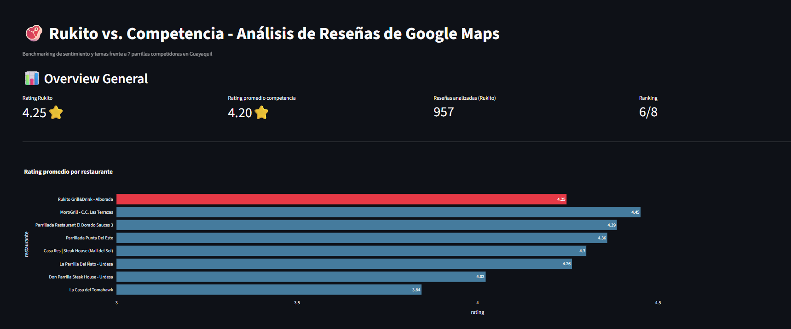

# 🥩 Rukito vs. Competencia — Análisis de Reseñas de Google Maps

Proyecto de **Data Analytics & NLP** para realizar un benchmarking competitivo de **Rukito Grill&Drink (Alborada, Guayaquil)** frente a 7 parrillas competidoras, transformando opiniones no estructuradas de Google Maps en insights accionables de negocio.

---

## 📊 Vistas del Proyecto
🔗 **[Ver Dashboard en vivo](https://rukito-competitor-analysis-dxqme59ou3th94wfwicoba.streamlit.app/)**

---

## 🚀 Estado del Proyecto
- [x] **Fase 1: Recolección de Datos** — Scraping de +900 reseñas en Google Maps vía Apify.
- [x] **Fase 2: Limpieza y Preprocesamiento** — Normalización de texto y remoción de duplicados/ruido.
- [x] **Fase 3: Análisis de Sentimiento** — Clasificación de polaridad (POS / NEU / NEG) con `pysentimiento` (RoBERTa).
- [x] **Fase 4: Modelado de Temas (Topic Modeling)** — Extracción de aspectos clave (*carne, precio, ambiente, moro, porciones, tiempo_espera, atencion_servicio*).
- [x] **Fase 5: Dashboard Interactivo** — Aplicación web funcional en Streamlit para toma de decisiones.

---

## 🛠️ Stack Tecnológico
* **Recolección:** Apify (Google Maps Scraper)
* **Procesamiento de Datos:** Python (`pandas`, `numpy`, `pathlib`)
* **Procesamiento de Lenguaje Natural (NLP):** `pysentimiento` (Transformers en español)
* **Visualización & Dashboard:** Streamlit, Plotly Express & Graph Objects

---

## 💡 Principales Hallazgos (Business Insights)


🔴 **Ambiente e instalaciones**: Debilidad más marcada. Rukito es el **único** restaurante del grupo con sentimiento neto negativo en este tema | Brecha de -0.11 vs. promedio competencia

🔴 **Atención al servicio** : Segunda debilidad más consistente, con la muestra más grande de todo el análisis | Brecha de -0.01 vs. promedio competencia

🔴 **Sabor de la comida** : Tercera debilidad, con porcentaje negativo leve, pero con importancia en el análisis | Brecha de -0.01 vs. promedio competencia

🟢 **Tiempo de espera** : Fortaleza relativa: la espera es un problema de **toda la industria** de parrillas en Guayaquil, pero Rukito lo maneja mejor que el promedio | Brecha de +0.52 vs. promedio competencia

🟡 **Moro** : Ligeramente por encima del promedio, sin ser una fortaleza dramática | Brecha de +0.32 vs. promedio competencia

---

## 📂 Estructura del Proyecto

```rukito-competitor-analysis/
│
├── data/
│   ├── raw/            ← CSVs originales de Apify, sin tocar nunca
│   ├── processed/       ← datos limpios (Fase 2)
│   └── final/            ← datos con sentimiento + temas listos para el dashboard
│
├── notebooks/            ← Jupyter notebooks 
│   ├── 01_scraping_check.ipynb
│   ├── 02_cleaning.ipynb
│   ├── 03_sentiment_analysis.ipynb
│   ├── 04_topic_extraction.ipynb
│   └── 05_comparative_insights.ipynb
│
├── src/                   ← funciones reutilizables en .py
│   ├── cleaning.py
│   ├── sentiment.py
│   └── topics.py
│
├── dashboard/
│   └── app.py            ← tu app de Streamlit (Fase 6)
│
├── reports/    
│   └── summary/            ← reporte ejecutivo / README final
│
├── requirements.txt
├── README.md
└── .gitignore
